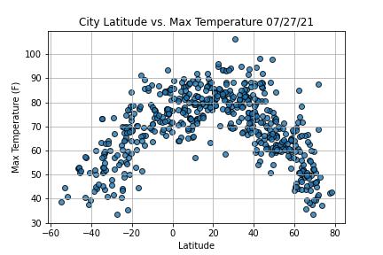
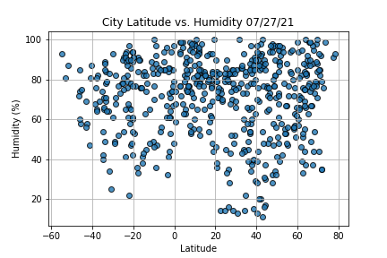
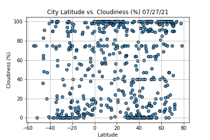
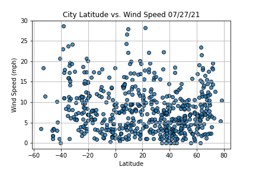
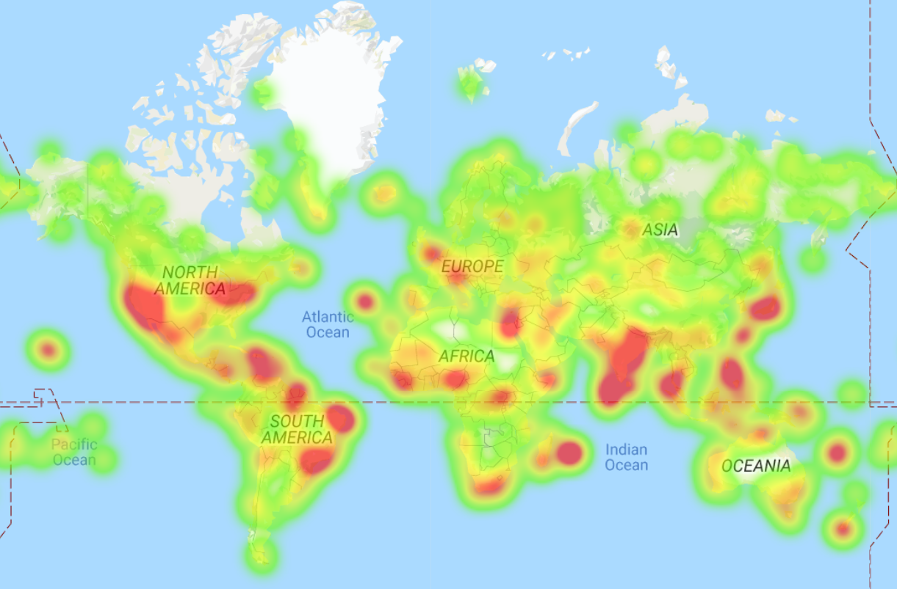
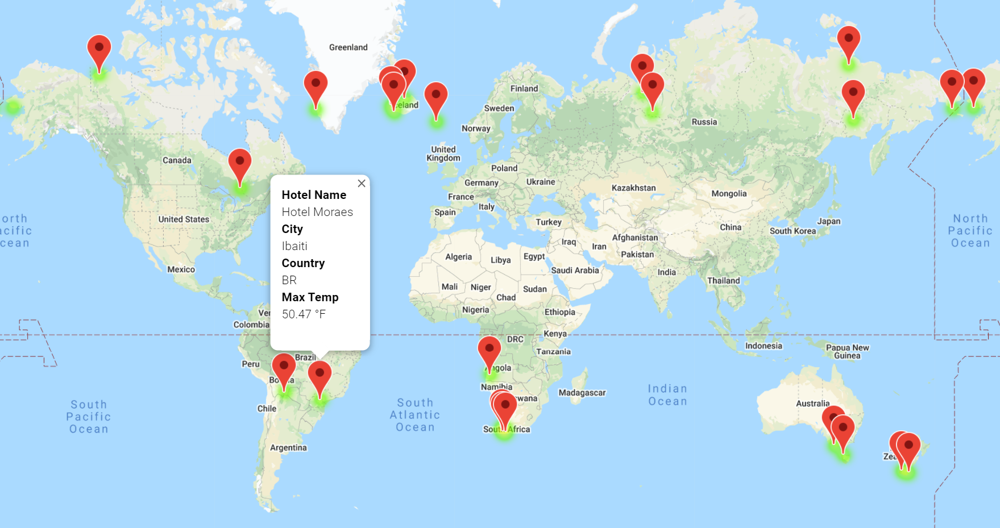
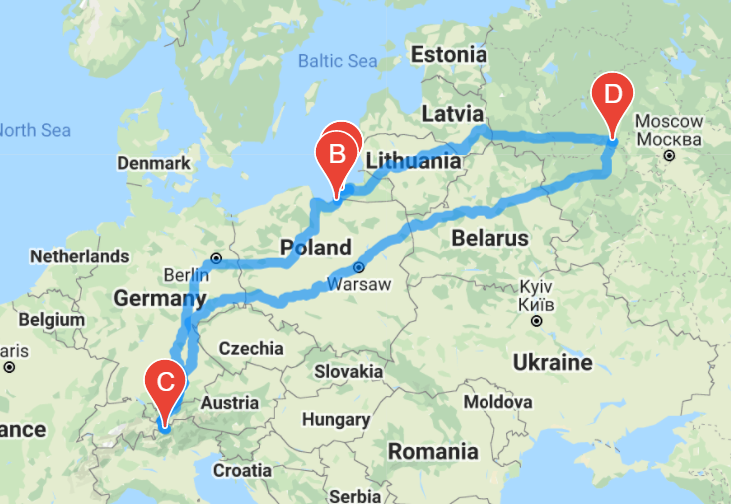
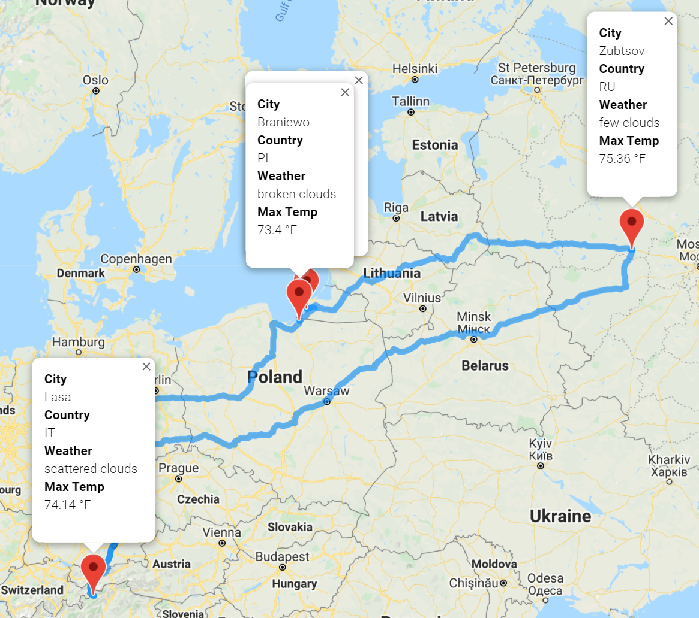

# World_Weather_Analysis

## Objective

Collect and present data for customers filtering destinations by their preferred travel criteria in order to find their ideal cities based on their ideal cities temperature.

## Tools

- Jupyter Notebook
- modules
  - gmap
  - citypay
  - pandas
  - matplotlib
- APIs
  - OpenWeather
  - google
    - Directions
    - Geocoding
    - Maps JavaScript
    - Places

## Results

### Exploration Analysis

An exploration analysis was made to understand the relations among Latitude and some weather variables.

### Heatmaps

Max Temp Heatmap

### Locations and Drivedirections maps

Hotels location

Itinerary without markers

Itinerary with markers

